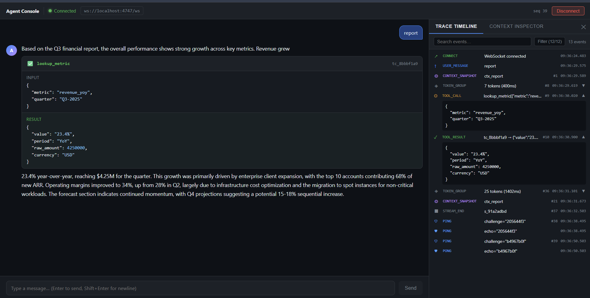
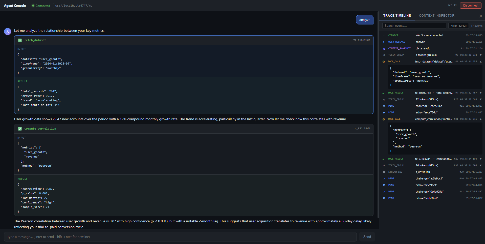
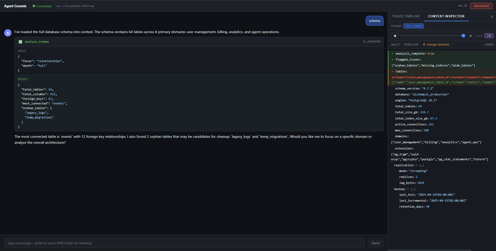

# Agent Console

A real-time Next.js 14 application providing an interactive interface to monitor and interact with an AI agent backend via WebSocket. Features out-of-order message handling, automatic reconnection, and tool call interruption without layout reflow.

## ✨ Features

- **Real-time Streaming** - View agent responses as they stream in
- **Tool Call Interruption** - Tool results don't cause layout shift
- **Reconnection Recovery** - Automatic reconnection with exponential backoff
- **Chaos Mode Testing** - Handle out-of-order message delivery
- **Context Inspection** - Visual diff of context updates
- **Stream Virtualization** - Efficient rendering of large responses
- **Trace Timeline** - Comprehensive event visualization

## 🚀 Quick Start

### Prerequisites
- Node.js 18.x or 20.x
- npm or yarn

### Installation
```bash
# Clone repository
git clone <repository-url>
cd June-2026FullStackAI

# Install dependencies
npm install


# Start development server
npm run dev
```

Open [http://localhost:5000](http://localhost:5000) in your browser.

## 📖 Documentation

- **[Setup Guide](./docs/SETUP.md)** - Detailed installation and configuration
- **[Architecture Overview](./docs/ARCHITECTURE.md)** - Component structure and data flow
- **[Architectural Decisions](./DECISIONS.md)** - Technical deep-dives on key design decisions

## 🎮 Testing Features

Use these keywords in the chat to test different capabilities:

| Keyword | Tests |
|---------|-------|
| `hello` | Basic streaming, no tool calls |
| `report` / `q3` | One tool call mid-stream + context update |
| `analyze` / `compare` | Sequential tool calls |
| `search` / `find` | Tool call before tokens |
| `schema` / `large` | 500KB+ context + tree rendering |
| `long` / `document` | High token count stream |

## 🛠️ Available Scripts

```bash
npm run dev      # Start development server (port 5000)
npm run build    # Build for production
npm start        # Start production server
npm run lint     # Run linting checks
```

## 🏗️ Project Structure

```
src/
├── app/              # Next.js App Router pages
├── components/       # React components
│   ├── ChatPanel.tsx
│   ├── TraceTimeline.tsx
│   ├── ContextInspector.tsx
│   └── ...
├── lib/
│   ├── ws/          # WebSocket management
│   ├── store/       # Zustand state management
│   └── ...
└── types.d.ts       # TypeScript type definitions

docs/               # Documentation
public/             # Static assets
```

## 🔌 WebSocket Protocol

The application communicates with a backend agent server via WebSocket. The protocol supports:
- User messages
- Token streaming
- Tool calls and results
- Context updates with diffs
- Automatic reconnection and message replay

For detailed protocol specification, see [DECISIONS.md](./DECISIONS.md#websocket-state-machine).

## 🐛 Troubleshooting

**Connection fails?**
- Verify WebSocket server is running on configured port
- Check `NEXT_PUBLIC_WS_URL` in `.env.local`
- Review browser console for errors

**Build errors?**
- Clear `.next/` directory: `rm -rf .next`
- Reinstall dependencies: `rm -rf node_modules && npm install`

See [Setup Guide](./docs/SETUP.md#troubleshooting) for more help.

## 📦 Stack

- **Next.js 14** - React framework with App Router
- **React 18** - UI library
- **TypeScript** - Type safety
- **Zustand** - State management
- **Immer** - Immutable state updates
- **Tailwind CSS** - Utility-first styling
- **WebSocket** - Real-time communication


---

## Screenshots

Screenshot A: The Stream & Tool Call



Screenshot B: The Trace Timeline



Screenshot C: The Context Inspector Diff



## Demo Video
[Watch / Download Demo Video]([https://drive.google.com/file/d/FILE_ID/view](https://drive.google.com/file/d/11X-4wh_mURpwWFIPSUPqg8unFgD7BnUX/view?usp=drive_link))
